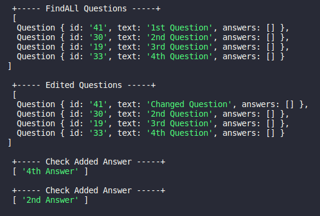
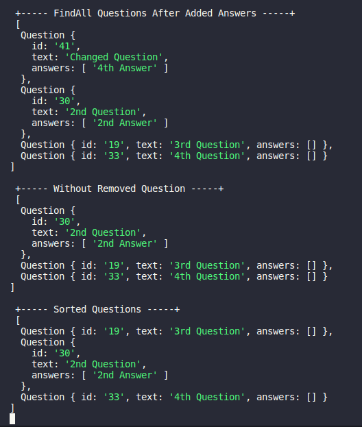

<h1 align="center"> Mentorship challenge  </h1>

### Question and answer system for company mentoring using Facade pattern

 

#### Exercise for didactic purposes

 

### `Functionalities`

- Add Question
- Edit Question
- Remove Question
- FindAll Questions
- Sort Questions
- Add Answer
- Check Answer

### `Instructions`

- Clone the repository
- Run the commands `npm install` and `npm start`

 

## Code Example

 

