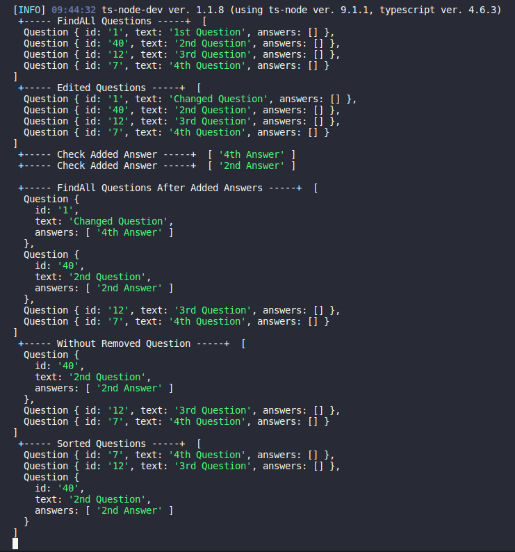

<h1 align="center"> Mentorship challenge  </h1>

## Question and answer system for company mentoring using Facade pattern

 

### Exercise for didactic purposes

 

## `Functionalities`

- Add Question
- Edit Question
- Remove Question
- FindAll Questions
- Sort Questions
- Add Answer
- Check ANswer

## `Instructions`

- Clone the repository
- Run the command `npm start`

 

